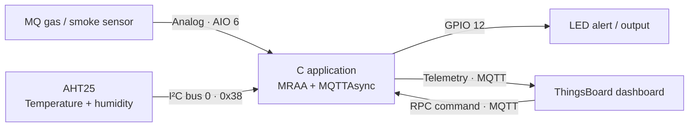

<div align="center">

# Embedded Linux Smart Home with ThingsBoard

### Monitor the environment locally. Visualize it remotely. Control it from the cloud.


</div>

> A C-based Embedded Linux project for the **PHYTEC Rugged Board A5D2x**. It reads gas/smoke, temperature, and humidity data; controls an LED automatically; publishes live telemetry to ThingsBoard; and accepts remote LED commands through MQTT RPC.

## Contents

- [From course foundation to project](#from-course-foundation-to-project)
- [Project overview](#project-overview)
- [System architecture](#system-architecture)
- [Hardware and configuration](#hardware-and-configuration)
- [How it works](#how-it-works)
- [Commands and workflow](#commands-and-workflow)
- [Project gallery](#project-gallery)
- [Troubleshooting](#troubleshooting)

---

## From course foundation to project

This repository represents hands-on Embedded Linux learning on the **Rugged Board A5D2x**, based on the **Microchip SAMA5D27** processor with an **ARM Cortex-A5** core.

The course work introduced the building blocks used in the final project:

| Area | Practical work |
|---|---|
| Embedded Linux and C | Building and transferring applications for an ARM target |
| MRAA and GPIO | LED and switch interfacing |
| UART | Serial communication and UART-controlled examples |
| ADC | Reading analog inputs such as potentiometer/LDR examples |
| I²C | Interfacing the AHT25 temperature and humidity sensor |
| MQTT / Mosquitto | Publisher–broker–subscriber exercises |
| ThingsBoard | Device telemetry, dashboard visualization, and RPC concepts |

The **Smart Home + ThingsBoard** application in `codes/Project.c` combines those interfaces into one end-to-end embedded IoT project.

---

## Project overview

The board continuously monitors an MQ gas/smoke sensor and an AHT25 temperature/humidity sensor. It processes the readings locally, controls an LED from a threshold rule, and sends the data to ThingsBoard through MQTT.

ThingsBoard also provides the reverse path: an RPC command from the dashboard can switch the LED on or off.

### What the project does

- Reads the **MQ gas/smoke sensor** through analog input **AIO 6**.
- Reads **temperature and humidity** from the **AHT25** on **I²C bus 0**, address **`0x38`**.
- Controls an **LED on GPIO 12**.
- Automatically turns the LED on when `mq_value > 70`.
- Sends telemetry to ThingsBoard every **2 seconds** using MQTT QoS 1.
- Receives ThingsBoard RPC requests for remote LED control.
- Sends an MQTT RPC response after executing the LED action.

---

## System architecture



```text
Sensors → Embedded Linux board → C / MRAA → MQTT → ThingsBoard dashboard
                                              ↑               │
                                              └── RPC control ┘
```

---

## Hardware and configuration

### Hardware used

| Component | Connection | Purpose |
|---|---|---|
| PHYTEC Rugged Board A5D2x | SAMA5D27 / ARM Cortex-A5 | Embedded Linux target |
| MQ gas/smoke sensor | Analog input AIO 6 | Gas/smoke-level input |
| AHT25 | I²C bus 0, `0x38` | Temperature and humidity |
| LED | GPIO 12 | Alert and remote-control output |

### Source configuration

| Setting | Value in `Project.c` |
|---|---|
| MQ analog pin | `6` |
| LED GPIO pin | `12` |
| AHT25 I²C bus | `0` |
| AHT25 address | `0x38` |
| MQ threshold | `70` |
| ThingsBoard broker | `tcp://mqtt.thingsboard.cloud:1883` |
| Telemetry topic | `v1/devices/me/telemetry` |
| RPC request topic | `v1/devices/me/rpc/request/+` |
| MQTT QoS | `1` |
| Telemetry interval | `2 seconds` |

### Keep the device token private

The code intentionally uses a placeholder. Add your own device token locally before building, and never commit it to GitHub.

```c
#define TOKEN "YOUR_DEVICE_ACCESS_TOKEN"
```

---

## How it works

### 1. Automatic monitoring and alert

The telemetry thread reads the MQ value using MRAA and applies the project's fixed rule:

| MQ reading | Status sent | Automatic LED state |
|---|---:|---|
| `mq_value > 70` | `smoke_detected: 1` | On |
| `mq_value <= 70` | `smoke_detected: 0` | Off |

The MQ value is used directly by the project. It is not presented as a calibrated gas-concentration measurement.

### 2. AHT25 sensor read

The program sends the AHT25 measurement command `0xAC 0x33 0x00`, waits **80 ms**, reads **6 bytes**, and converts the raw values to temperature (°C) and relative humidity (%).

If the AHT25 read fails, the program still publishes the MQ and LED data for that cycle.

### 3. Telemetry sent to ThingsBoard

On a successful AHT25 read, the application publishes this JSON structure to `v1/devices/me/telemetry`:

```json
{
  "mq_value": 50,
  "smoke_detected": 0,
  "temperature": 28.38,
  "humidity": 65.55,
  "led_status": 0
}
```

| Field | Meaning |
|---|---|
| `mq_value` | Raw analog value read from the MQ sensor |
| `smoke_detected` | `1` above the threshold; otherwise `0` |
| `temperature` | AHT25 reading in °C |
| `humidity` | AHT25 reading in % |
| `led_status` | LED state calculated from the MQ rule |

### 4. Remote LED control with RPC

ThingsBoard sends an RPC message to the board over MQTT. The code handles boolean `params` values such as:

```json
{"method":"setLed","params":true}
```

| RPC value | LED action |
|---|---|
| `true` | LED on |
| `false` | LED off |

The application responds on `v1/devices/me/rpc/response/<requestId>` with:

```json
{"result":"LED action executed successfully"}
```

> The next automatic sensor cycle can set the LED again according to the MQ threshold rule.

---

## Commands and workflow

### Commands used during the Embedded Linux exercises

The course notes use the following generic build-and-transfer sequence for example programs:

```bash
# Compile with the compiler / cross-compiler configured in the course environment
$CC program.c -o program

# Make the transferred program executable on the target
chmod +x program

# Run it on the board
./program
```

For transfer testing, the included TFTP setup material uses:

```bash
# On the development PC
touch test.txt && cp test.txt /var/lib/tftpboot

# On the Rugged Board
tftp -r test.txt -g <PC_IP>
```

The MQTT/Mosquitto learning exercise uses this publisher/subscriber pattern:

```bash
# Publish
mosquitto_pub -t test/topic -m "Hello"

# Subscribe
mosquitto_sub -t test/topic
```

### Build the final project

`Project.c` requires MRAA, the Eclipse Paho asynchronous MQTT C API (`MQTTAsync`), and POSIX threads. The repository does **not** contain a Makefile or a complete toolchain-specific compile command for this file.

Use the Rugged Board SDK/toolchain configured in your environment to build an ARM-compatible binary, linking the MRAA, Paho MQTT asynchronous, and pthread libraries. Do not deploy a host-native binary to the board.

### Run checklist

Before starting the application, confirm:

1. The MQ sensor, AHT25, and LED are connected to the mappings above.
2. MRAA and the Paho MQTT runtime are installed on the target.
3. The ThingsBoard device token has been configured privately.
4. The board can reach `mqtt.thingsboard.cloud:1883`.
5. The executable was built for the board's ARM target.

---

## Repository layout

The uploaded project is organized as follows. This README is intended to sit in the `Linux/` directory.

```text
Linux/
├── codes/
│   ├── Project.c                 # Smart Home + ThingsBoard application
│   ├── adc_basic.c               # MRAA analog-input example
│   ├── ldr.c                     # LDR and LED example
│   ├── pc13_mraa.c               # MRAA GPIO LED example
│   ├── simple_sw_led.c           # Switch-to-LED MRAA example
│   ├── simple_uart_led.c         # UART/LED example
│   ├── switch_mraa.c             # MRAA switch example
│   ├── uart_bas.c                # Basic UART example
│   ├── Led_Blink_GPIO.c          # Sysfs GPIO LED example
│   ├── led_sw.c                  # Sysfs LED/switch example
│   ├── leds_blink.c              # Multi-LED sysfs example
│   └── LDR Datasheet.pdf
├── notes/
│   ├── day1- intro.png
│   ├── day2-led.png
│   ├── day3-4_UART-ADC_MQTT.png
│   └── day5-project         # Smart-home project diagram and screenshots
├── pdfs/
│   ├── 01_SerialTerminal.pdf
│   ├── RBGPIO_LED_PPT.pdf
│   └── RuggedBoard-A5D2x_Hardware_Manual_V1.1.pdf
├── elinux_pkg.sh                  # Development-package installation script
├── elinux_pkg1.sh                 # Same package-installation content
├── elinux_pkg3.sh                 # Same package-installation content
└── tftp-script.sh                 # Host-side TFTP/NFS setup script
```

The small programs in `codes/` are standalone learning examples. `codes/Project.c` is the integrated smart-home application documented here.


---

## Project gallery

Add your images here after placing them in an `assets/images/` folder in the repository. Suggested filenames are shown below so the gallery stays organized and easy to update.

| Add | Suggested file | Suggested caption |
|---|---|---|
| Board photo | `assets/images/rugged-board.jpg` | PHYTEC Rugged Board A5D2x |
| Hardware setup | `assets/images/hardware-setup.jpg` | MQ sensor, AHT25, LED, and board wiring |
| Terminal output | `assets/images/terminal-output.jpg` | Live telemetry published from the board |
| ThingsBoard dashboard | `assets/images/thingsboard-dashboard.jpg` | Temperature and humidity visualization |
| RPC demonstration | `assets/images/rpc-control.jpg` | Remote LED control from ThingsBoard |

<!--
When the files are added, replace this comment with image links such as:


-->

---

## Troubleshooting

| Issue | What to check |
|---|---|
| MQ sensor read fails | AIO 6 mapping, wiring, and MRAA availability |
| AHT25 read fails | I²C wiring, bus `0`, address `0x38`, and sensor power |
| MQTT connection fails | Network access, ThingsBoard address/port, and device token |
| No dashboard data | Device token, telemetry topic, and ThingsBoard dashboard widgets |
| RPC has no effect | Boolean `params` value, subscription, and GPIO 12 wiring |
| `Exec format error` | Rebuild with the correct ARM toolchain for the board |

## Technical highlights

- Embedded Linux and ARM-based application deployment
- C programming with MRAA for AIO, GPIO, and I²C
- Sensor integration and threshold-based device control
- Asynchronous MQTT telemetry using Eclipse Paho
- ThingsBoard telemetry, dashboard integration, and RPC
- POSIX threading, signal handling, and resource cleanup

## License

License: not specified in the supplied repository.

## Author

Afnan Jhadwale
